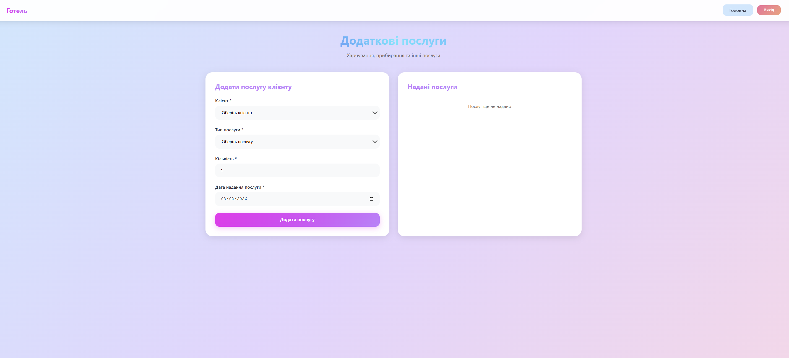

# 🏨 Hotel Booking Website

Welcome to the repository for the Hotel Booking project. This is a web application designed to showcase hotel rooms, services, and calculate booking costs.


## 🌐 Live Demo

You can view the live project here:
👉 **[Open Website on GitHub Pages](https://alexandra-adamchyk.github.io/hotel/)**

## 📷 Gallery

### User Interface & Features

| Main Menu | Guest Registration | Room Booking |
| :---: | :---: | :---: |
|  |  |  |

| Additional Services | Cost Calculation | Data Overview |
| :---: | :---: | :---: |
|  |  |  |

---

## 📂 Project Structure

The project consists of the following pages:

- **🏠 index.html** — Main landing page with general hotel info.
- **🛏️ rooms.html** — Catalog of available rooms with photos and descriptions.
- **📅 bookings.html** — Reservation form page.
- **🧮 calculation.html** — Logic for calculating the cost of the stay (JS).
- **👥 guests.html** — Guest information section.
- **🥂 services.html** — Additional hotel services (Restaurant, Spa, etc.).
- **styles/** — CSS files for styling and layout.
- **scripts/** — JavaScript files for functionality.

## 🛠️ Technologies Used

This project is built using pure front-end technologies:
*   **HTML5** — Semantic structure.
*   **CSS3** — Styling and responsive design.
*   **JavaScript** — Dynamic logic for forms and calculations.

## 🚀 How to Run Locally

1. Clone the repository:
   ```bash
   git clone https://github.com/alexandra-adamchyk/YOUR_REPO_NAME.git
